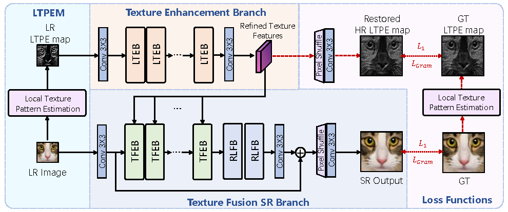
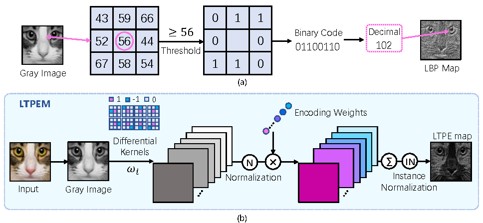

## LTPEN

PyTorch implementation of Local Texture Pattern Estimation for Image Detail Super-Resolution(TPAMI 2025)[[Paper]](https://ieeexplore.ieee.org/document/10903996)


<p align="center">
  
</p>

<p align="center">
  
</p>


## Dependencies

- Python 3 (Recommend to use [Anaconda](https://www.anaconda.com/download/#linux))
- [PyTorch >= 1.0](https://pytorch.org/)
- NVIDIA GPU + [CUDA](https://developer.nvidia.com/cuda-downloads)
- Python packages: `pip install numpy opencv-python lmdb pyyaml`
- TensorBoard: 
  - PyTorch >= 1.1: `pip install tb-nightly future`
  - PyTorch == 1.0: `pip install tensorboardX`

## LTPE

run script to get ltpe of your pics :

`python ltpe/ltpe.py`

## Training 

To train : 

`python train.py -opt options/train/train_spsr.json`

- The json file will be processed by `options/options.py`.

- Before running this code, please modify `train_spsr.json` to your own configurations including: 
  - the proper `dataroot_HR` and `dataroot_LR` paths for the data loader
  - saving frequency for models and states
  - whether to resume training with `.state` files
  - other hyperparameters
  - loss function, etc. 

- You can find your training results in `./experiments`.

- During training, you can use Tesorboard to monitor the losses with
`tensorboard --logdir tb_logger/NAME_OF_YOUR_EXPERIMENT`

## Testing

To generate SR images by :

`python test.py -opt options/test/test_spsr.json`

- Similar to training, the configurations can be modified in the `test_spsr.json` file.


- You can put your own LR images in a certain folder and just change the `dataroot_LR` setting in `test_spsr.json` and run `test.py`. 


## Acknowledgement
The code is based on [BasicSR](https://github.com/xinntao/BasicSR) and [SPSR](https://github.com/Maclory/SPSR). 

If you find our work useful in your research, please consider citing:
```
@ARTICLE{10903996,
  author={Fan, Fan and Zhao, Yang and Chen, Yuan and Li, Nannan and Jia, Wei and Wang, Ronggang},
  journal={IEEE Transactions on Pattern Analysis and Machine Intelligence}, 
  title={Local Texture Pattern Estimation for Image Detail Super-Resolution}, 
  year={2025},
  volume={},
  number={},
  pages={1-18},
  keywords={Image restoration;Training;Superresolution;Image reconstruction;Generative adversarial networks;Feature extraction;Estimation;Data mining;Semantics;Loss measurement;Super-resolution;Texture restoration;Local texture pattern estimation;Local binary pattern},
  doi={10.1109/TPAMI.2025.3545571}}
```
